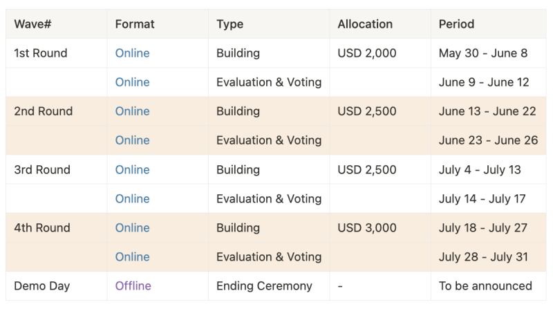

https://app.akindo.io/wave-hacks/JB29Nk61kfQpLPKr



# Wallet Monitor Project

A complete blockchain wallet monitoring system using Nodit APIs.

## Project Structure

```
wallet-monitor/
├── backend/          # Node.js Express backend
│   ├── server.js     # Main server file (copy from artifacts)
│   ├── package.json  # Backend dependencies
│   ├── .env         # Environment variables (add your API key)
│   └── README.md    # Backend documentation
├── frontend/         # React frontend
│   ├── src/
│   │   └── App.js   # Main component (copy from artifacts)
│   ├── package.json # Frontend dependencies
│   └── README.md    # Frontend documentation
└── README.md        # This file
```

## Quick Start

1. **Get Nodit API Key**: Sign up at https://nodit.lambda256.io

2. **Setup Backend**:
   ```bash
   cd backend
   # Add your API key to .env file
   echo "NODIT_API_KEY=your_actual_api_key" > .env
   echo "PORT=3001" >> .env
   # Copy server.js code from artifacts
   npm run dev
   ```

3. **Setup Frontend**:
   ```bash
   cd frontend
   # Copy the React component code to src/App.js
   npm start
   ```

## Features

- Multi-blockchain wallet monitoring
- Real-time balance and transaction tracking
- Token and NFT holdings
- Automated background monitoring
- Web-based dashboard
- Support for 13+ blockchain networks

## Supported Networks

- Ethereum, Polygon, Arbitrum, Base, Optimism
- Avalanche, Tron, Bitcoin, Dogecoin, XRPL
- Kaia, Luniverse, Chiliz

## API Documentation

See `backend/README.md` for detailed API documentation.


## Deployment (vercel)

```bash
vercel project
vercel link --yes --project dpolls
yarn build:demo && vercel build --prod && vercel --prebuilt --prod
```
## Deployment (Beta)

```bash

vercel project
vercel link --yes --project dpolls-beta
yarn build:demo && vercel build --prod && vercel --prebuilt --prod